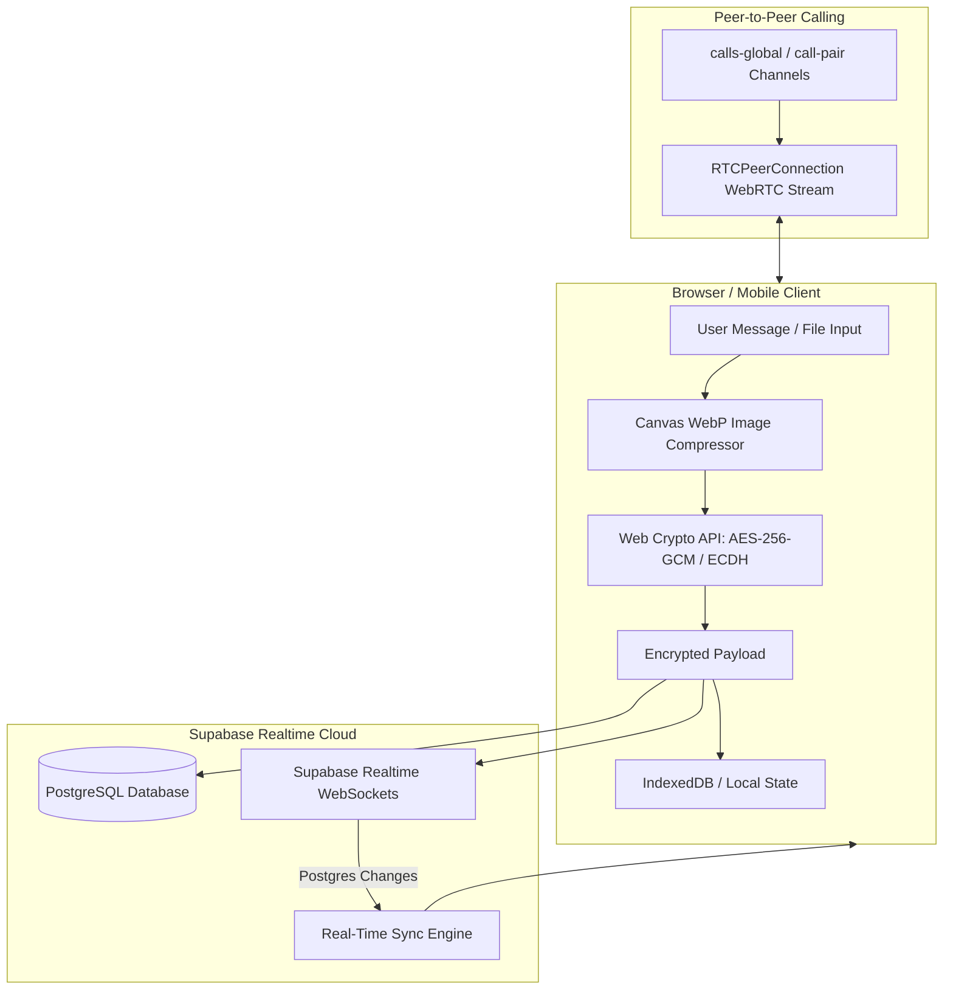

<div align="center">

# 💬 NodeTalk

**Next-Generation End-to-End Encrypted Real-Time Messaging & WebRTC Video Calling Platform**

[](https://github.com/VishnuSreeVidya/NodeTalk/actions)
[](https://react.dev)
[](https://vitest.dev)
[](LICENSE)
[](https://react.dev)
[](https://supabase.com)

[🚀 Live Demo App](https://nodetalk-sli6.onrender.com/) · [🐛 Report Bug](https://github.com/VishnuSreeVidya/NodeTalk/issues) · [💡 Request Feature](https://github.com/VishnuSreeVidya/NodeTalk/issues)

</div>

---

## 📸 Interface Showcase

| Desktop Interface & Live E2EE Chat | Mobile Adaptive Viewport & Navigation |
| :---: | :---: |
|  |  |
| *End-to-End Encrypted Direct Messages with real-time delivery receipts, presence, and lock badges* | *Dynamic `100dvh` mobile container fitting, drawer navigation (`←`), and flexbox safeguards* |

---

## ⚡ System Overview

**NodeTalk** is an enterprise-grade real-time web application built using **React 19**, **Vite 8**, **Supabase**, and **WebRTC**. It delivers military-grade End-to-End Encryption (E2EE) for 1-on-1 communications, instant WebSockets message delivery, peer-to-peer audio/video calling, client-side media compression, and responsive mobile viewport layouts.

Zero plaintext messages or private key material are ever stored or exposed on backend servers.

---

## ✨ Primary Capabilities

### 🔐 1. End-to-End Encryption & Key Security
* **Web Crypto API Native Primaries**: 1-on-1 messages are encrypted client-side using **AES-256-GCM** with **ECDH (P-256)** key exchange.
* **100,000 Iteration PBKDF2 Backup Protection**: User private key backups stored in Supabase are protected using **PBKDF2-HMAC-SHA256** with **100,000 iterations**, securing credentials against brute-force attacks while supporting seamless legacy migrations.

### 📱 2. Dynamic Mobile Viewport & Responsive Layouts
* **Dynamic Viewport Height (`100dvh`)**: Mobile layout containers adjust dynamically to prevent browser address bars from clipping input controls.
* **Mobile Drawer Navigation**: Slide-over contact sidebar with quick back navigation arrow (`←`) for small mobile displays (`< 768px`).
* **Flexbox Safeguards (`min-w-0 flex-grow`)**: Chat input bars and attachment buttons flex fluidly on narrow screens (360px–414px) without horizontal scrolling.

### 📞 3. Peer-to-Peer WebRTC Audio/Video Calling
* **Global Call Signaling (`calls-global`)**: Incoming call offers broadcast across persistent global channels for instant ringing overlays regardless of active screen state.
* **Dedicated Pair Channel Routing**: Real-time SDP answer and ICE candidate negotiation route through isolated pair channels (`call-pair-XXX`).
* **Interactive Media Controls**: Toggle audio mute, video pause, and screen sharing during active calls.

### ⚡ 4. Real-time Messaging & Media Optimization
* **Live Presence & Typing Indicators**: Real-time online status and animated typing indicators displaying active user handles (`User is typing...`).
* **Automated WebP Image Compression**: Uploaded photos (up to 1600x1600) are automatically compressed to WebP on the client before being sent to Supabase Storage.
* **Message Deletions**: Full support for both **Delete for Me** and **Delete for Everyone**.

---

## 🏗️ Architecture & Security Model



---

## 🛠️ Tech Stack Architecture

| Layer | Technology Used |
| :--- | :--- |
| **Frontend Framework** | React 19, Vite 8, Tailwind CSS, Framer Motion |
| **Database & Auth** | Supabase (PostgreSQL, Row Level Security, Auth) |
| **Real-time Protocol** | Supabase Realtime (WebSocket channels, `postgres_changes`) |
| **Cryptography** | Web Crypto API (`AES-256-GCM`, `ECDH P-256`, `100,000 PBKDF2`) |
| **Media & Calls** | WebRTC (`RTCPeerConnection`), HTML5 Canvas Image Compressor |
| **Quality Assurance** | Vitest (58 Passed), Testing Library, ESLint (`0 Errors/Warnings`) |

---

## 🚀 Getting Started

### 1. Prerequisites
- **Node.js**: `v18.x` or higher
- **npm**: `v9.x` or higher
- **Supabase Account**: A active Supabase project instance

### 2. Installation
```bash
# 1. Clone repository
git clone https://github.com/VishnuSreeVidya/NodeTalk.git
cd NodeTalk

# 2. Install Node dependencies
npm install
```

### 3. Environment Configuration
Create a `.env` file in the project root:

```env
VITE_SUPABASE_URL=https://your-project.supabase.co
VITE_SUPABASE_ANON_KEY=your-supabase-anon-key
```

### 4. Database Setup Pipeline
Execute the SQL migration scripts sequentially in your Supabase SQL Editor:
1. `supabase-schema.sql` — Base tables, RLS policies, and Auth setup.
2. `supabase-migration-v2.sql` through `v8.sql` — Group management, reactions, and starred messages.
3. `supabase-migration-v9.sql` — Delete for Me & Delete for Everyone policies.

### 5. Running the Application
```bash
# Start local development server
npm run dev

# Build production bundle
npm run build

# Preview production build
npm run preview
```

---

## 🧪 Testing & Quality Assurance

Run the automated test suite covering crypto round-trips, offline queues, scroll management, and message deletion:

```bash
# Run Vitest test suite
npm run test

# Run ESLint code quality check
npm run lint
```

**Test Output:**
```text
 Test Files  8 passed (8)
      Tests  58 passed (58)
   Start at  20:13:31
   Duration  4.82s
```

---

## 📜 License
Distributed under the **MIT License**. See `LICENSE` for details.

---

<div align="center">
  Crafted with ❤️ by <b><a href="https://github.com/VishnuSreeVidya">Vishnu Sree Vidya Kotturu</a></b>
</div>
