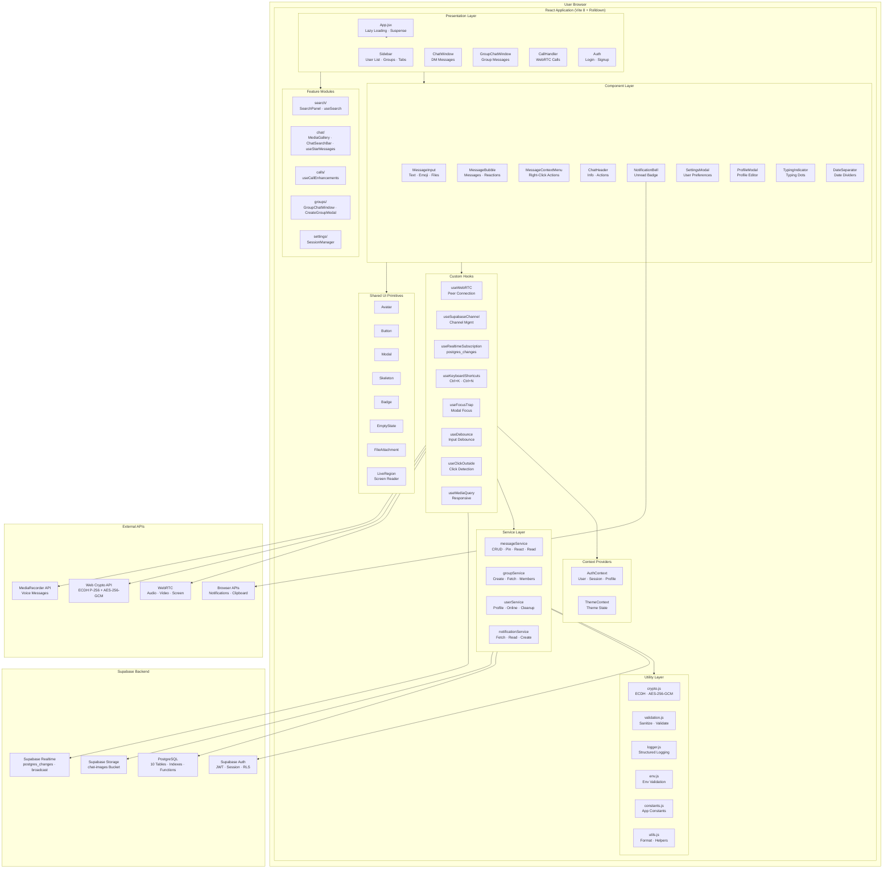
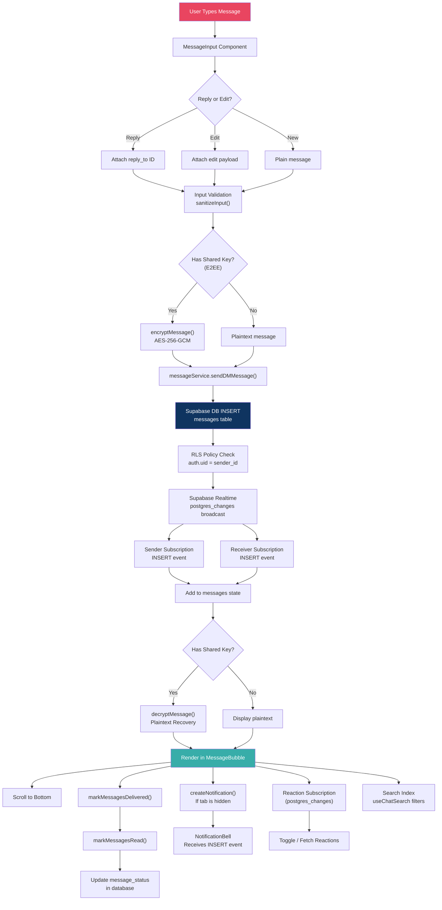
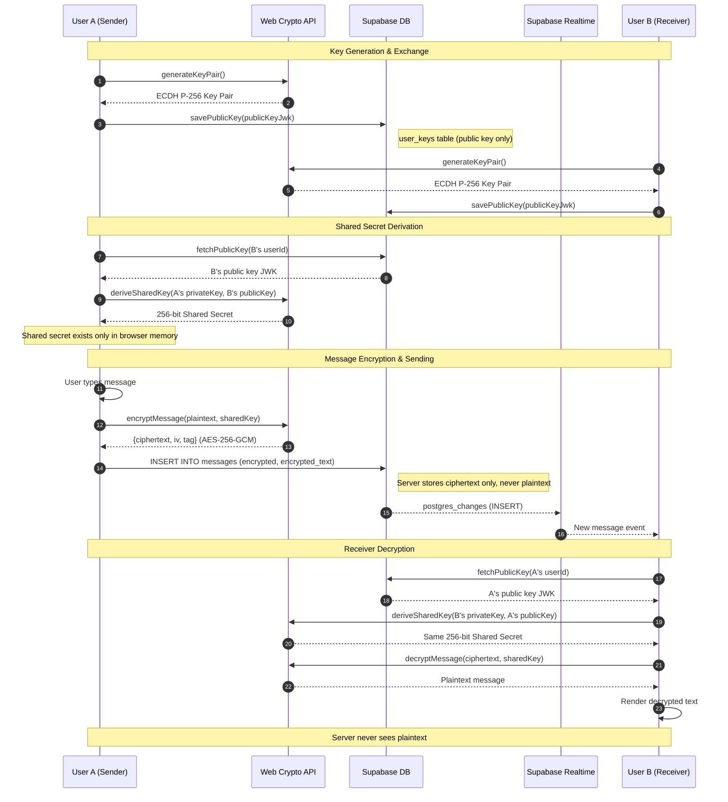
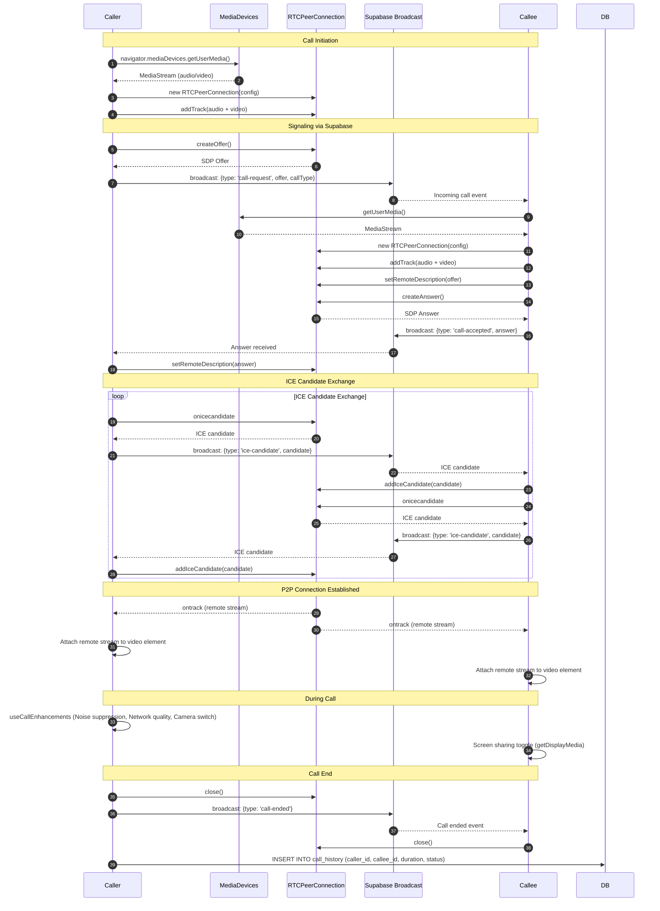
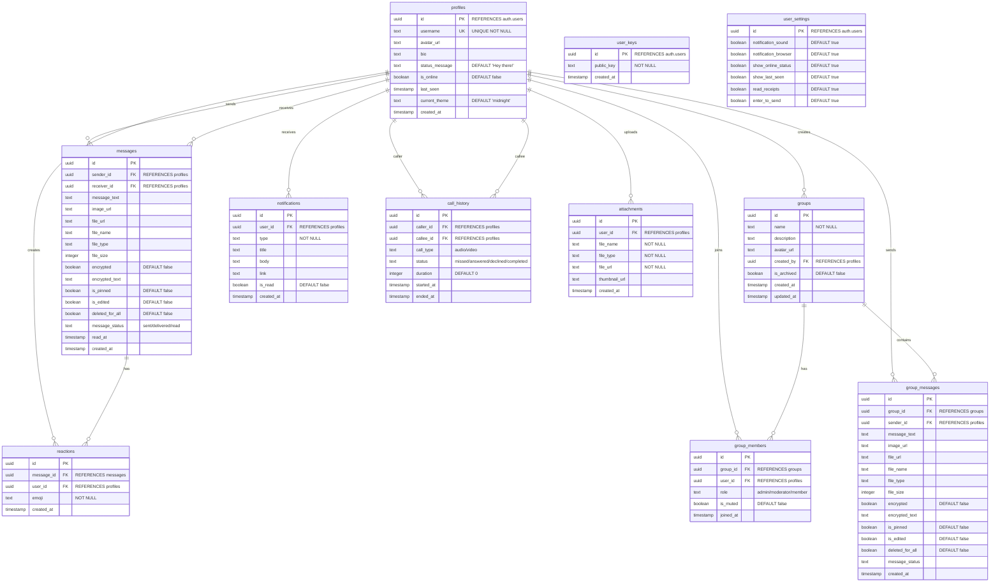
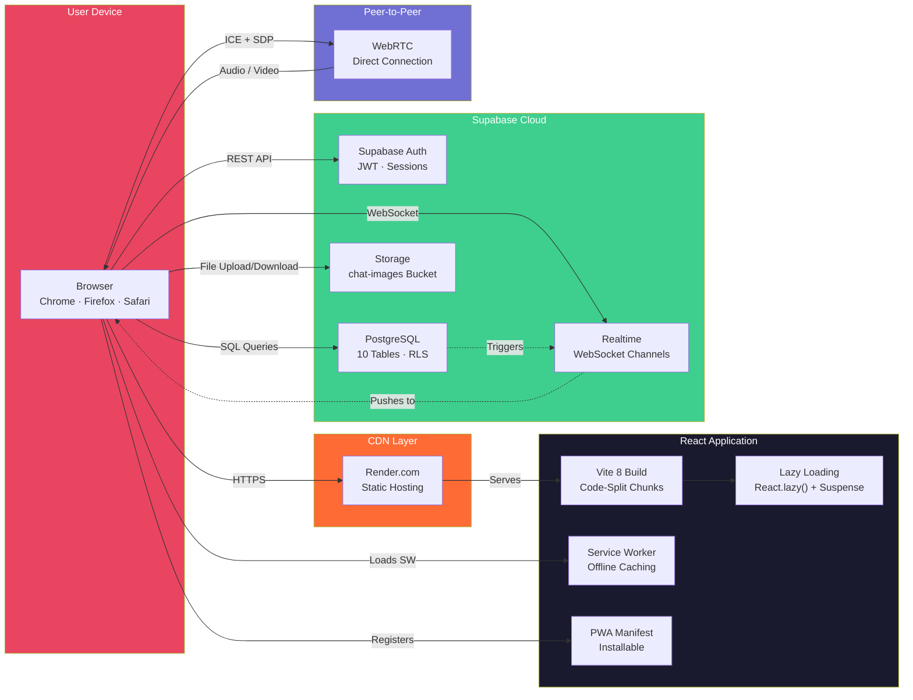

<div align="center">

# NodeTalk

**A real-time end-to-end encrypted messaging platform**

[](https://github.com/VishnuSreeVidya/NodeTalk/actions/workflows/ci.yml)
[](LICENSE)
[](https://react.dev)
[](https://vite.dev)
[](https://supabase.com)
[](https://webrtc.org)
[](https://tailwindcss.com)
[](https://web.dev/progressive-web-apps/)
[](https://vitest.dev)
[](https://framer.com/motion)

[Live Demo](https://nodetalk-sli6.onrender.com/) · [Report Bug](https://github.com/VishnuSreeVidya/NodeTalk/issues)

</div>

---

NodeTalk is a secure real-time messaging platform with end-to-end encryption, audio/video calls, group chats, and file sharing. Built with React, Supabase, and WebRTC, it demonstrates modern full-stack engineering practices including real-time data synchronization, cryptographic key exchange, and responsive UI design.

## Highlights

- **End-to-end encryption** &mdash; AES-256-GCM with ECDH P-256 key exchange
- **Real-time messaging** &mdash; Sub-second delivery via Supabase Realtime
- **Audio & video calls** &mdash; Peer-to-peer WebRTC with screen sharing
- **Group chats** &mdash; Multi-member rooms with role management
- **File sharing** &mdash; Images, documents, voice messages with inline preview
- **6 themes** &mdash; Midnight, Graphite, Ocean, Forest, Light Pro, AMOLED
- **Read receipts** &mdash; Sent, delivered, and read status
- **Progressive Web App** &mdash; Installable with offline caching
- **Responsive design** &mdash; Desktop, tablet, and mobile layouts
- **Accessibility** &mdash; ARIA labels, focus trapping, keyboard shortcuts

---

## Table of Contents

- [Screenshots](#screenshots)
- [Demo](#demo)
- [Messaging](#messaging)
- [Calls](#calls)
- [Media](#media)
- [Security](#security)
- [User Experience](#user-experience)
- [Tech Stack](#tech-stack)
- [Architecture](#architecture)
- [Getting Started](#getting-started)
- [Project Structure](#project-structure)
- [Scripts](#scripts)
- [Testing](#testing)
- [Code Splitting](#code-splitting)
- [Why I Built NodeTalk](#why-i-built-nodetalk)
- [Roadmap](#roadmap)
- [Contributing](#contributing)
- [License](#license)

---


## Messaging

| Feature | Details |
|---------|---------|
| Real-time delivery | Supabase Realtime with `postgres_changes` subscriptions |
| End-to-end encryption | AES-256-GCM with ECDH P-256 key exchange (Web Crypto API) |
| Edit & delete | Modify or remove messages for yourself or everyone |
| Pin messages | Persistent pins in DMs and groups |
| Star messages | Personal bookmarks per user |
| Threaded replies | Quote-preview blocks with context |
| Reactions | Emoji reactions with real-time sync |
| Read receipts | Sent (single tick), delivered (double tick gray), read (double tick accent) |
| Date separators | Automated dividers between message groups |
| Markdown rendering | Bold, italic, inline code, and fenced code blocks |

### Search

- **Global search** &mdash; Across all users and messages with debounced input
- **In-conversation search** &mdash; Filter within a specific chat
- **Filter by type** &mdash; Messages, images, files, and voice notes

### Groups

- Create groups with multiple members and role-based permissions (admin, moderator, member)
- Real-time group messaging with independent message channels
- Typing indicators per group member
- Pin messages within groups
- Mute individual groups

---

## Calls

| Feature | Details |
|---------|---------|
| Audio calls | Peer-to-peer via WebRTC |
| Video calls | Peer-to-peer with front/rear camera switch |
| Screen sharing | Share entire screen or application window |
| Noise suppression | Real-time filtering via AudioContext |
| Network quality | Live indicator during active calls |
| Call timer | Duration display during calls |
| Call history | Persistent log of missed, answered, and declined calls |

---

## Media

| Feature | Details |
|---------|---------|
| File upload | Any file type with type and size validation |
| Image sharing | Upload with lazy-loaded preview and fullscreen view |
| Voice messages | Record via MediaRecorder API with live duration indicator |
| Media gallery | Four tabs (media, files, links, voice) with fullscreen preview |
| Inline playback | Audio and video players within chat bubbles |

---

## Security

- **Authentication** &mdash; Supabase Auth with JWT sessions and auto-refresh
- **Row Level Security** &mdash; RLS policies on all tables (profiles, messages, groups, notifications, settings)
- **End-to-end encryption** &mdash; Private keys stored in IndexedDB; server never sees plaintext
- **Input validation** &mdash; Sanitization on all user inputs
- **XSS prevention** &mdash; No `innerHTML` usage; safe React rendering patterns
- **Environment validation** &mdash; Required variables checked at startup
- **Structured logging** &mdash; No secrets or sensitive data exposed in logs

---

## User Experience

| Feature | Details |
|---------|---------|
| Themes | 6 professionally crafted themes (Midnight, Graphite, Ocean, Forest, Light Pro, AMOLED) |
| Animations | Page transitions, hover effects, and micro-interactions via Framer Motion |
| Online presence | Real-time status with last seen timestamps |
| Typing indicators | Per-user and per-group typing status |
| Emoji picker | Built-in grid for message reactions and composition |
| Profile editor | Username, bio, status message, avatar upload |
| Settings panel | Notifications, privacy, read receipts, enter-to-send toggle |
| Notification bell | In-app dropdown with unread count and mark-as-read |
| Skeleton loading | Placeholder states during data fetches |
| Responsive layout | Adaptive sidebar collapse, mobile hamburger menu, overlay panels |
| Keyboard shortcuts | `Ctrl+K` search, `Ctrl+N` new chat, `Escape` close |

### Accessibility

- ARIA labels on all interactive elements
- Focus trapping in modals, dropdowns, and dialogs
- Live regions for screen reader announcements
- Keyboard-navigable with visible focus indicators

---

## Tech Stack

| Layer | Technology |
|:------|:-----------|
| **Frontend** | React 19, Vite 8, Tailwind CSS 3, Framer Motion |
| **Backend** | Supabase (PostgreSQL, Auth, Storage, Realtime) |
| **Real-time** | Supabase Realtime (postgres_changes, broadcast channels) |
| **Encryption** | Web Crypto API (ECDH P-256, AES-256-GCM) |
| **Calls** | WebRTC (RTCPeerConnection, getDisplayMedia) |
| **Recording** | MediaRecorder API (audio/webm; codecs=opus) |
| **Testing** | Vitest, Testing Library, jsdom |
| **CI/CD** | GitHub Actions (lint, build, test) |

---

## Architecture

### Overall System Architecture



### Message Flow



### End-to-End Encryption Flow



### WebRTC Call Flow



### Database Schema



### Security Architecture


### Deployment Architecture



---

## Getting Started

### Prerequisites

- Node.js 24+
- npm
- A [Supabase](https://supabase.com) project (Free Tier supported)

### Installation

```bash
git clone https://github.com/VishnuSreeVidya/NodeTalk.git
cd NodeTalk
npm install
cp .env.example .env
```

Edit `.env` with your Supabase credentials:

```env
VITE_SUPABASE_URL=https://your-project.supabase.co
VITE_SUPABASE_ANON_KEY=your-anon-key
```

### Database Setup

Open the Supabase SQL Editor and run these files **in order**:

| Order | File | What it creates |
|:-----:|:-----|:----------------|
| 1 | `supabase-schema.sql` | Profiles, Messages, User Keys, Reactions, RLS Policies, Triggers |
| 2 | `supabase-migration-v2.sql` | Groups, Group Members, Notifications, Call History, Settings |
| 3 | `supabase-migration-v3.sql` | File sharing columns (file_url, file_name, file_type, file_size) |
| 4 | `supabase-migration-v4.sql` | Read receipts (read_at column + index) |
| 5 | `supabase-migration-v5.sql` | Indexes, DB functions, new columns, conversation_summary view |

### Storage Setup

Create a public storage bucket named `chat-images` in Supabase Storage, or run the Storage SQL at the bottom of `supabase-schema.sql`.

### Run

```bash
npm run dev
```

Open [http://localhost:5173](http://localhost:5173).

---

## Project Structure

```
NodeTalk/
├── public/
│   ├── manifest.json              # PWA manifest
│   └── sw.js                      # Service worker
│
├── src/
│   ├── components/
│   │   ├── shared/                # Reusable components
│   │   │   ├── ChatHeader.jsx
│   │   │   ├── DateSeparator.jsx
│   │   │   ├── MessageContextMenu.jsx
│   │   │   ├── TypingIndicator.jsx
│   │   │   └── index.js
│   │   ├── Auth.jsx
│   │   ├── CallHandler.jsx        # WebRTC call management
│   │   ├── ChatWindow.jsx         # DM chat (lazy-loaded)
│   │   ├── EmojiPicker.jsx
│   │   ├── ErrorBoundary.jsx
│   │   ├── FileUpload.jsx
│   │   ├── ImageUpload.jsx
│   │   ├── MessageBubble.jsx
│   │   ├── MessageInput.jsx
│   │   ├── NotificationBell.jsx
│   │   ├── ProfileModal.jsx
│   │   ├── ReactionBar.jsx
│   │   ├── ReplyPreview.jsx
│   │   ├── SettingsModal.jsx
│   │   ├── Sidebar.jsx            # User list + groups (lazy-loaded)
│   │   ├── ThemeSelector.jsx
│   │   ├── Toast.jsx
│   │   └── VoiceRecorder.jsx
│   │
│   ├── context/
│   │   ├── AuthContext.jsx
│   │   └── ThemeContext.jsx
│   │
│   ├── features/
│   │   ├── calls/hooks/
│   │   │   └── useCallEnhancements.js
│   │   ├── chat/
│   │   │   ├── components/        # ChatSearchBar, MediaGallery
│   │   │   └── hooks/             # useChatSearch, useStarMessages
│   │   ├── groups/                # GroupChatWindow, CreateGroupModal
│   │   ├── search/                # SearchPanel, useSearch
│   │   └── settings/              # SessionManager
│   │
│   ├── hooks/
│   │   ├── useClickOutside.js
│   │   ├── useDebounce.js
│   │   ├── useFocusTrap.js
│   │   ├── useKeyboardShortcuts.js
│   │   ├── useMediaQuery.js
│   │   ├── useRealtimeSubscription.js
│   │   ├── useSupabaseChannel.js
│   │   └── useWebRTC.js
│   │
│   ├── lib/
│   │   ├── constants.js
│   │   ├── env.js                 # Environment validation
│   │   ├── logger.js              # Structured logging
│   │   ├── supabase.js            # Re-exports supabaseClient
│   │   └── utils.js               # Formatters, sanitizers
│   │
│   ├── services/
│   │   ├── index.js               # Barrel exports
│   │   ├── messageService.js
│   │   ├── groupService.js
│   │   ├── notificationService.js
│   │   └── userService.js
│   │
│   ├── test/
│   │   └── setup.js               # Test mocks
│   │
│   ├── ui/                        # Shared UI primitives
│   │   ├── __tests__/
│   │   │   └── Button.test.jsx
│   │   ├── Avatar.jsx
│   │   ├── Badge.jsx
│   │   ├── Button.jsx
│   │   ├── EmptyState.jsx
│   │   ├── FileAttachment.jsx
│   │   ├── LiveRegion.jsx
│   │   ├── Modal.jsx
│   │   └── Skeleton.jsx
│   │
│   ├── utils/
│   │   ├── crypto.js              # E2EE encryption/decryption
│   │   └── validation.js
│   │
│   ├── App.jsx
│   ├── main.jsx
│   ├── index.css                  # Design system + 6 themes
│   └── supabaseClient.js
│
├── .env.example
├── .github/workflows/ci.yml
├── supabase-schema.sql
├── supabase-migration-v2.sql
├── supabase-migration-v3.sql
├── supabase-migration-v4.sql
├── supabase-migration-v5.sql
├── vitest.config.js
├── eslint.config.js
├── vite.config.js
└── package.json
```

---

## Scripts

| Command | Description |
|:--------|:------------|
| `npm run dev` | Start development server |
| `npm run build` | Production build |
| `npm run preview` | Preview production build |
| `npm run lint` | Run ESLint |
| `npm run test` | Run test suite |

---

## Testing

```bash
npm run test
```

**35 tests** across 3 suites &mdash; all passing.

| Suite | Tests | What is tested |
|:------|:-----:|:---------------|
| `src/lib/__tests__/utils.test.js` | 29 | `formatMessageTime`, `formatDateSeparator`, `shouldShowDateSeparator`, `truncate`, `getInitials`, `cn`, `formatFileSize`, `getFileType`, `escapeHtml`, `parseMarkdown` |
| `src/ui/__tests__/Button.test.jsx` | 4 | Rendering, loading spinner, disabled state, click handler |
| `src/hooks/__tests__/useDebounce.test.js` | 2 | Initial value, debounced value updates |

### Testing approach

- **Unit tests** &mdash; Pure utility functions tested in isolation
- **Component tests** &mdash; React Testing Library for interaction and rendering
- **Hook tests** &mdash; Custom hooks tested with `renderHook`

---

## Code Splitting

The production build uses Vite's code-splitting with `React.lazy()` and `Suspense` to split the bundle into multiple chunks:

- **Vendor separation** &mdash; React, Supabase, and Framer Motion in dedicated chunks
- **Route-level splitting** &mdash; ChatWindow, GroupChatWindow, and CallHandler load on demand
- **Tree shaking** &mdash; Unused exports removed during build
- **Asset optimization** &mdash; CSS minified, JS compressed with gzip

---

## Why I Built NodeTalk

I built NodeTalk to explore modern full-stack engineering patterns in a practical, feature-rich application. The project allowed me to work deeply with real-time data synchronization, cryptographic protocols (ECDH key exchange and AES-256-GCM encryption), peer-to-peer media streaming via WebRTC, and responsive UI design with a CSS custom property-based theming system. Every component was an opportunity to apply production-quality patterns: lazy loading, error boundaries, accessibility, and comprehensive state management through React contexts and hooks.

---

## Roadmap

- [x] End-to-end encryption
- [x] Real-time messaging
- [x] Audio & video calls
- [x] Group chats
- [x] File sharing
- [x] Voice messages
- [x] Read receipts
- [x] Progressive Web App
- [x] 6 themes
- [ ] Native mobile app
- [ ] Push notifications
- [ ] Chat backup & restore
- [ ] AI assistant integration
- [ ] Message search across encrypted content
- [ ] End-to-end encryption for group messages

---

## CI/CD

GitHub Actions pipeline runs on every push and pull request to `master`:

```
Lint → Build → Test
```

- **Lint** &mdash; ESLint with zero errors
- **Build** &mdash; Vite production build
- **Test** &mdash; Vitest test suite

---

## Keyboard Shortcuts

| Shortcut | Action |
|:---------|:-------|
| `Ctrl + K` | Open search |
| `Ctrl + N` | New chat |
| `Escape` | Close modal/panel |
| `Enter` | Send message |
| `Shift + Enter` | New line |

---

## Contributing

1. Fork the repository
2. Create a feature branch (`git checkout -b feature/my-feature`)
3. Make your changes
4. Run checks before committing:
   ```bash
   npm run lint && npm run test && npm run build
   ```
5. Commit with a descriptive message
6. Push to your branch and open a Pull Request

---

## License

This project is licensed under the MIT License.

---

<div align="center">

**Built by [Vishnu Sree Vidya Kotturu](https://github.com/VishnuSreeVidya)**

If this project helped you, consider giving it a star.

</div>
