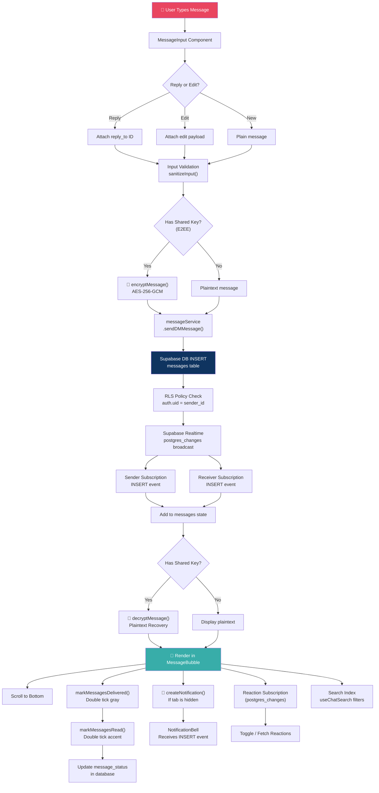
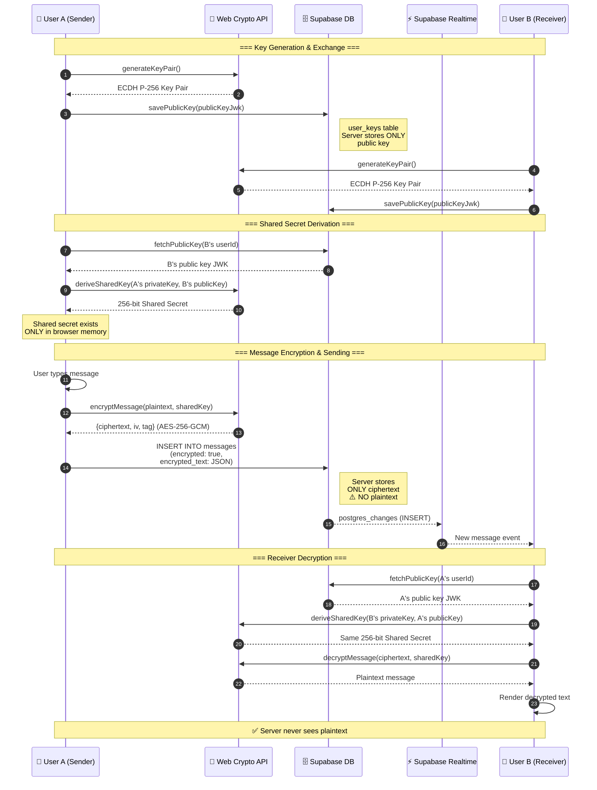
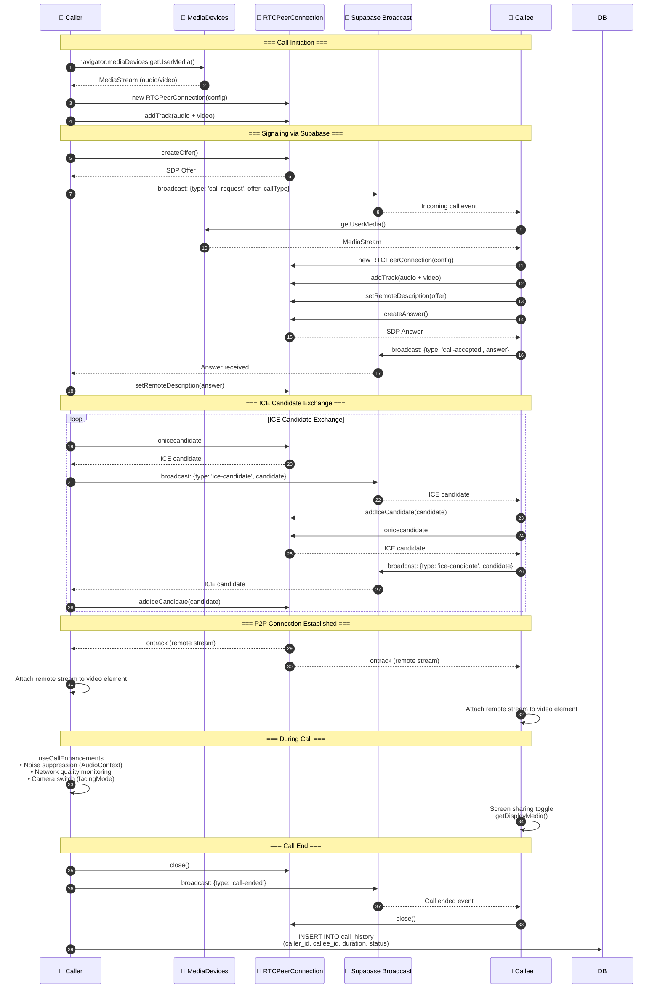
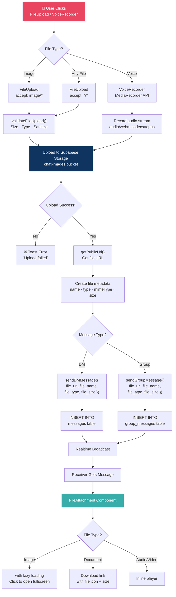
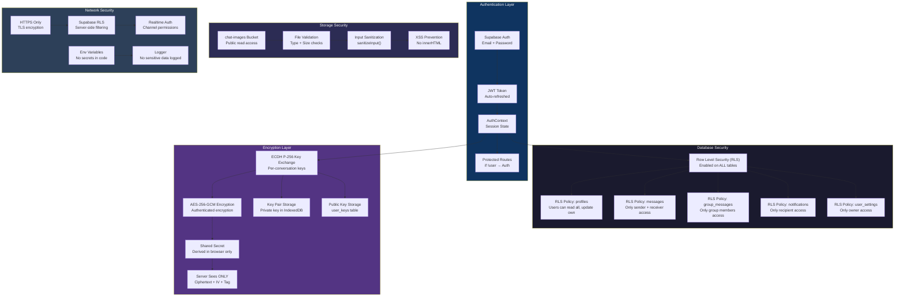
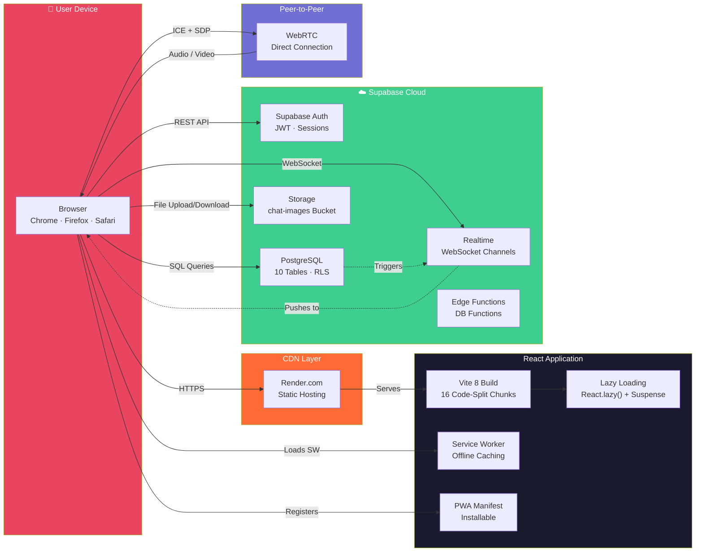

<div align="center">

# NodeTalk

**A production-grade real-time messaging platform**

[](https://github.com/VishnuSreeVidya/NodeTalk/actions/workflows/ci.yml)
[](LICENSE)
[](https://nodejs.org)
[](https://react.dev)
[](https://supabase.com)
[](https://vite.dev)

[Live Demo](https://nodetalk-sli6.onrender.com/) · [Report Bug](https://github.com/VishnuSreeVidya/NodeTalk/issues) · [Request Feature](https://github.com/VishnuSreeVidya/NodeTalk/issues)

</div>

---

NodeTalk is a feature-rich messaging application with end-to-end encryption, real-time messaging, audio/video calls, group chats, and a fully responsive glassmorphism UI. Built with React, Vite 8, Supabase, and WebRTC.

## Features

<details>
<summary><strong>Messaging</strong></summary>

- **Real-time delivery** via Supabase Realtime with postgres_changes subscriptions
- **End-to-end encryption** using AES-256-GCM with ECDH P-256 key exchange (Web Crypto API)
- **Edit & delete** messages for yourself or everyone
- **Pin messages** for quick access in DMs and groups
- **Star messages** for personal bookmarks
- **Threaded replies** with quote-preview blocks
- **Message reactions** with emoji
- **Date separators** between message groups
- **Markdown rendering** (bold, italic, inline code, code blocks)

</details>

<details>
<summary><strong>Search</strong></summary>

- **Global search** across all users and messages with debounced input
- **In-conversation search** to find messages within a specific chat

</details>

<details>
<summary><strong>Read Receipts</strong></summary>

- ✓ Single tick (gray) — message sent
- ✓✓ Double tick (gray) — message delivered
- ✓✓ Double tick (accent) — message read
- Realtime updates via Supabase Realtime

</details>

<details>
<summary><strong>Group Chats</strong></summary>

- Create groups with multiple members
- Real-time group messaging with member management
- Typing indicators for groups
- Pin messages within groups

</details>

<details>
<summary><strong>File Sharing & Media</strong></summary>

- Share any file type (documents, archives, audio, video)
- Image sharing with preview
- Voice messages with live duration indicator
- Media gallery with 4 tabs (media, files, links, voice) and fullscreen preview

</details>

<details>
<summary><strong>Calls</strong></summary>

- Audio and video calls via WebRTC (peer-to-peer)
- Screen sharing during video calls
- Call duration timer
- Noise suppression via AudioContext
- Real-time network quality indicator
- Camera switch (front/rear)

</details>

<details>
<summary><strong>User Experience</strong></summary>

- Online presence with last seen timestamps
- Typing indicators (DM and group)
- Built-in emoji picker
- Profile editor (username, status, avatar)
- Settings panel (notifications, privacy, read receipts, enter-to-send)
- In-app notification bell with unread count
- Skeleton loading states
- Responsive design (desktop, tablet, mobile)

</details>

<details>
<summary><strong>Themes</strong></summary>

| Theme | Description |
|-------|-------------|
| Glass Dark | Elegant frosted-glass interface |
| Vibrant Amethyst | Purple gradient with glowing effects |
| Retro Cyberpunk | Neon-inspired cyberpunk aesthetic |

</details>

<details>
<summary><strong>Accessibility</strong></summary>

- Keyboard focus trapping in modals and dropdowns
- Screen reader support with live regions and ARIA alerts
- Keyboard shortcuts (`Ctrl+K` search, `Ctrl+N` new chat, `Escape` close)
- Full ARIA labeling on interactive elements

</details>

<details>
<summary><strong>Progressive Web App</strong></summary>

- Installable on mobile and desktop
- Service worker with offline caching for static assets
- Full PWA manifest with icons and theme color

</details>

---

## Architecture

### 1. Overall System Architecture


---

### 2. Message Flow



---

### 3. End-to-End Encryption Flow



---

### 4. WebRTC Call Flow



---

### 5. Group Chat Flow

```mermaid
flowchart TD
    subgraph Creation["Group Creation"]
        A1["👤 User Opens<br/>CreateGroupModal"] --> A2["Type Group Name<br/>+ Description"]
        A2 --> A3["Search & Select<br/>Members"]
        A3 --> A4["groupService<br/>.createGroup()"]
        A4 --> A5["INSERT INTO groups"]
        A4 --> A6["INSERT INTO group_members<br/>admin + members"]
        A5 --> A7["Sidebar refreshes<br/>groups list"]
    end

    subgraph Messaging["Group Messaging"]
        B1["User Opens<br/>GroupChatWindow"] --> B2["fetchGroupMessages()<br/>fetchGroupMembers()"]
        B2 --> B3["Subscribe to<br/>group-messages-{id}<br/>(postgres_changes)"]
        B3 --> B4["Realtime INSERT<br/>events arrive"]
        B4 --> B5["Add to messages state"]
        B5 --> B6["🎨 Render with<br/>MessageBubble"]
    end

    subgraph Sending["Send Message"]
        C1["User Types Message"] --> C2["sendGroupMessage(payload)"]
        C2 --> C3["INSERT INTO<br/>group_messages"]
        C3 --> C4["Realtime Broadcast<br/>to all members"]
        C4 --> C5["Each member's<br/>subscription fires"]
        C5 --> C6["Messages update<br/>in real-time"]
    end

    subgraph Typing["Typing Indicators"]
        D1["User Types"] --> D2["broadcastTyping()<br/>Supabase channel"]
        D2 --> D3["broadcast: typing event"]
        D3 --> D4["Other members<br/>receive broadcast"]
        D4 --> D5["TypingIndicator<br/>shows name"]
        D5 --> D6["Timeout 2-3s<br/>clears indicator"]
    end

    subgraph Reactions["Reactions & Pins"]
        E1["User Right-Clicks<br/>Message"] --> E2["MessageContextMenu"]
        E2 --> E3{"Action"}
        E3 -->|React| E4["toggleReaction()"]
        E3 -->|Pin| E5["UPDATE is_pinned<br/>on group_messages"]
        E3 -->|Reply| E6["Set replyTo state"]
        E3 -->|Delete| E7["deleteGroupMessage()"]
    end

    style Creation fill:#0f3460,color:#fff
    style Messaging fill:#1a1a2e,color:#fff
    style Sending fill:#16213e,color:#fff
    style Typing fill:#2c2c54,color:#fff
    style Reactions fill:#533483,color:#fff
```



---

### 6. File Sharing Flow



---

### 7. Database Schema


---

### 8. Frontend Component Architecture

```mermaid
graph TB
    subgraph Entry["Entry Point"]
        Main["main.jsx<br/>validateEnv() · mount"]
        IndexCSS["index.css<br/>Themes · Global Styles"]
    end

    subgraph Root["Application Root"]
        App["App.jsx<br/>Lazy Loading · Suspense · Routes"]
    end

    subgraph Providers["Context Providers"]
        AuthProvider["AuthProvider<br/>user · profile · signIn · signOut"]
        ThemeProvider["ThemeProvider<br/>currentTheme · setTheme"]
    end

    subgraph Layout["Layout Components"]
        SidebarComp["Sidebar<br/>Tabs · Users · Groups · Search"]
        ChatWin["ChatWindow<br/>DM Messages"]
        GroupWin["GroupChatWindow<br/>Group Messages"]
        CallHand["CallHandler<br/>WebRTC Management"]
        AuthPage["Auth<br/>Login · Signup"]
    end

    subgraph ChatComponents["Chat Components"]
        MsgInput["MessageInput<br/>Text · Emoji · Files · Reply"]
        MsgBubble["MessageBubble<br/>Content · Reactions · Reply"]
        MsgCtxMenu["MessageContextMenu<br/>Copy · Reply · Edit · Delete · Pin"]
        ReplyPrev["ReplyPreview<br/>Quote Block"]
        ReactionBarComp["ReactionBar<br/>Emoji Toggle"]
        EmojiP["EmojiPicker<br/>Emoji Grid"]
        FileUp["FileUpload<br/>File Input · Validation"]
        VoiceRec["VoiceRecorder<br/>MediaRecorder"]
        ImageUp["ImageUpload<br/>Image Input"]
    end

    subgraph SharedComponents["Shared Components"]
        ChatHdr["ChatHeader<br/>Avatar · Status · Actions"]
        DateSepComp["DateSeparator<br/>Date Labels"]
        TypingIndComp["TypingIndicator<br/>Dots Animation"]
    end

    subgraph ModalComponents["Modals"]
        ProfileMod["ProfileModal<br/>Edit Profile"]
        SettingsMod["SettingsModal<br/>Preferences"]
        CreateGrpMod["CreateGroupModal<br/>Group Setup"]
        SearchPanelComp["SearchPanel<br/>Global Search"]
        MediaGal["MediaGallery<br/>Files · Media · Links"]
        SessionMgr["SessionManager<br/>Active Sessions"]
    end

    subgraph UIComponents["UI Primitives"]
        AvatarUI["Avatar"]
        ButtonUI["Button"]
        ModalUI["Modal"]
        SkeletonUI["Skeleton"]
        BadgeUI["Badge"]
        EmptyStateUI["EmptyState"]
        FileAttachUI["FileAttachment"]
        LiveRegUI["LiveRegion"]
        ToastUI["Toast"]
    end

    subgraph HooksLayer["Custom Hooks"]
        UseWebRTC["useWebRTC<br/>RTCPeerConnection"]
        UseCallEnh["useCallEnhancements<br/>Noise · Quality · Switch"]
        UseSupaCh["useSupabaseChannel<br/>Channel Lifecycle"]
        UseRealtime["useRealtimeSubscription<br/>postgres_changes"]
        UseKeybd["useKeyboardShortcuts<br/>Global Shortcuts"]
        UseFocusTrap["useFocusTrap<br/>Focus Management"]
        UseDebounce["useDebounce<br/>Input Throttle"]
        UseClickOut["useClickOutside<br/>Dismiss Detection"]
        UseMediaQ["useMediaQuery<br/>Responsive Breakpoints"]
    end

    subgraph ServicesLayer["Service Layer"]
        MsgService["messageService<br/>15 functions"]
        GroupService["groupService<br/>3 functions"]
        UserService["userService<br/>5 functions"]
        NotifService["notificationService<br/>4 functions"]
    end

    subgraph UtilitiesLayer["Utilities"]
        CryptoUtil["crypto.js<br/>9 functions"]
        ValidationUtil["validation.js<br/>7 functions"]
        LoggerUtil["logger.js<br/>Structured logging"]
        EnvUtil["env.js<br/>Env validation"]
        ConstUtil["constants.js<br/>App constants"]
        UtilsUtil["utils.js<br/>Formatters"]
    end

    Main --> App
    App --> Providers
    Providers --> Layout
    Layout --> ChatComponents
    Layout --> ModalComponents
    ChatComponents --> SharedComponents
    ChatComponents --> UIComponents
    ModalComponents --> UIComponents
    Layout --> UIComponents
    ChatComponents --> HooksLayer
    Layout --> HooksLayer
    HooksLayer --> ServicesLayer
    HooksLayer --> Providers
    ServicesLayer --> UtilitiesLayer

    style Entry fill:#0a0a23,color:#fff
    style Root fill:#1a1a2e,color:#fff
    style Providers fill:#16213e,color:#fff
    style Layout fill:#0f3460,color:#fff
    style ChatComponents fill:#533483,color:#fff
    style SharedComponents fill:#2c2c54,color:#fff
    style ModalComponents fill:#2c2c54,color:#fff
    style UIComponents fill:#1e1e3f,color:#aaa
    style HooksLayer fill:#e94560,color:#fff
    style ServicesLayer fill:#38ada9,color:#fff
    style UtilitiesLayer fill:#2d4059,color:#fff
```



---

### 9. Security Architecture



---

### 10. Deployment Architecture



---

## Tech Stack

<div align="center">

| Layer | Technology |
|:------|:-----------|
| **Frontend** | React 19 · Vite 8 · Tailwind CSS 3 · Framer Motion |
| **Backend** | Supabase (PostgreSQL · Auth · Storage · Realtime) |
| **Realtime** | Supabase Realtime (postgres_changes + broadcast channels) |
| **Encryption** | Web Crypto API (ECDH P-256 + AES-256-GCM) |
| **Calls** | WebRTC (RTCPeerConnection) |
| **Recording** | MediaRecorder API |
| **Testing** | Vitest · Testing Library · jsdom |
| **CI/CD** | GitHub Actions (lint → build → test) |

</div>

---

## Getting Started

### Prerequisites

- Node.js 24+
- npm
- A [Supabase](https://supabase.com) project (Free Tier supported)

### Installation

```bash
# Clone the repository
git clone https://github.com/VishnuSreeVidya/NodeTalk.git
cd NodeTalk

# Install dependencies
npm install

# Create environment file
cp .env.example .env
```

Edit `.env` with your Supabase credentials:

```env
VITE_SUPABASE_URL=https://your-project.supabase.co
VITE_SUPABASE_ANON_KEY=your-anon-key
```

### Database Setup

Open the Supabase SQL Editor and run these files **in order**:

| Order | File | What it creates |
|:-----:|:-----|:----------------|
| 1 | `supabase-schema.sql` | Profiles, Messages, User Keys, Reactions, RLS Policies, Triggers |
| 2 | `supabase-migration-v2.sql` | Groups, Group Members, Notifications, Call History, Settings |
| 3 | `supabase-migration-v3.sql` | File sharing columns (file_url, file_name, file_type, file_size) |
| 4 | `supabase-migration-v4.sql` | Read receipts (read_at column + index) |
| 5 | `supabase-migration-v5.sql` | 9 indexes, 5 DB functions, new columns, conversation_summary view |

### Storage Setup

Create a public storage bucket named `chat-images` in Supabase Storage, or run the Storage SQL at the bottom of `supabase-schema.sql`.

### Run

```bash
npm run dev
```

Open [http://localhost:5173](http://localhost:5173).

---

## Scripts

| Command | Description |
|:--------|:------------|
| `npm run dev` | Start development server |
| `npm run build` | Production build with code splitting |
| `npm run preview` | Preview production build |
| `npm run lint` | Run ESLint |
| `npm run test` | Run test suite |

---

## Project Structure

```
NodeTalk/
├── public/
│   ├── manifest.json              # PWA manifest
│   └── sw.js                      # Service worker
│
├── src/
│   ├── components/
│   │   ├── shared/                # Reusable components
│   │   │   ├── ChatHeader.jsx
│   │   │   ├── DateSeparator.jsx
│   │   │   ├── MessageContextMenu.jsx
│   │   │   └── TypingIndicator.jsx
│   │   ├── Auth.jsx
│   │   ├── CallHandler.jsx        # WebRTC call management
│   │   ├── ChatWindow.jsx         # DM chat (lazy-loaded)
│   │   ├── ErrorBoundary.jsx      # Error boundary with logging
│   │   ├── MessageBubble.jsx
│   │   ├── MessageInput.jsx
│   │   ├── NotificationBell.jsx
│   │   ├── Sidebar.jsx            # User list + groups (lazy-loaded)
│   │   └── VoiceRecorder.jsx
│   │
│   ├── features/
│   │   ├── calls/hooks/           # Noise suppression, PiP, network quality
│   │   ├── chat/                  # Search, media gallery, star messages
│   │   ├── groups/                # Group chat + create modal
│   │   ├── search/                # Global search panel
│   │   └── settings/              # Multi-device session manager
│   │
│   ├── hooks/
│   │   ├── useFocusTrap.js        # Modal focus trapping
│   │   ├── useKeyboardShortcuts.js
│   │   ├── useRealtimeSubscription.js
│   │   └── useSupabaseChannel.js
│   │
│   ├── lib/
│   │   ├── constants.js           # App-wide constants
│   │   ├── env.js                 # Env validation + config
│   │   ├── logger.js              # Structured logging
│   │   └── utils.js
│   │
│   ├── services/                  # Service layer (API/DB logic)
│   │   ├── messageService.js
│   │   ├── groupService.js
│   │   ├── notificationService.js
│   │   └── userService.js
│   │
│   ├── test/setup.js              # Test mocks
│   ├── ui/                        # Shared UI primitives
│   │   ├── Avatar.jsx
│   │   ├── Button.jsx
│   │   ├── LiveRegion.jsx         # Screen reader announcements
│   │   ├── Modal.jsx
│   │   └── Skeleton.jsx
│   │
│   ├── utils/
│   │   ├── crypto.js              # E2EE encryption/decryption
│   │   └── validation.js          # Input sanitization
│   │
│   ├── App.jsx                    # Root with lazy loading + Suspense
│   ├── main.jsx                   # Entry with env validation
│   └── index.css
│
├── .github/workflows/ci.yml       # CI pipeline
├── supabase-schema.sql
├── supabase-migration-v2.sql
├── supabase-migration-v3.sql
├── supabase-migration-v4.sql
├── supabase-migration-v5.sql
├── vitest.config.js
├── eslint.config.js
├── vite.config.js
└── package.json
```

---

## Code Splitting

The production build is split into 16 optimized chunks:

| Chunk | Size (gzip) | Contents |
|:------|:------------|:---------|
| `react-vendor` | 57 KB | React + ReactDOM |
| `supabase` | 51 KB | Supabase client |
| `framer` | 43 KB | Framer Motion |
| `messageService` | 9 KB | Message service layer |
| `Sidebar` | 8 KB | Sidebar component |
| `date-fns` | 6 KB | Date utilities |
| `index` | 5 KB | App entry |
| `ChatWindow` | 4 KB | DM chat window |
| `CallHandler` | 3 KB | Call handling |
| `GroupChatWindow` | 3 KB | Group chat window |
| + 6 more | — | Auth, ThemeSelector, Avatar, Search, etc. |

---

## Testing

```bash
npm run test
```

36 tests across 3 suites:

| Suite | Tests | Description |
|:------|:------|:------------|
| `src/lib/__tests__/utils.test.js` | 29 | Utility functions |
| `src/ui/__tests__/Button.test.jsx` | 5 | Button component |
| `src/hooks/__tests__/useDebounce.test.js` | 2 | Debounce hook |

---

## CI/CD

GitHub Actions pipeline runs on every push and pull request to `master`/`main`:

```
Lint → Build → Test
```

- **Lint** — ESLint with zero errors
- **Build** — Vite production build with code splitting
- **Test** — Vitest test suite

---

## Keyboard Shortcuts

| Shortcut | Action |
|:---------|:-------|
| `Ctrl + K` | Open search |
| `Ctrl + N` | New chat |
| `Escape` | Close modal/panel |
| `Enter` | Send message |
| `Shift + Enter` | New line |

---

## Security

- **Authentication** — Supabase Auth with protected routes
- **RLS** — Row Level Security on all database tables
- **E2EE** — AES-256-GCM + ECDH P-256 (server never sees plaintext)
- **Validation** — Input sanitization on all user inputs
- **Storage** — Secured file storage with access policies
- **Env** — Environment variable validation on startup
- **Logging** — Structured error logging (no secrets exposed)

---

## Contributing

Contributions are welcome!

1. Fork the repository
2. Create a feature branch (`git checkout -b feature/my-feature`)
3. Make your changes
4. Run checks before committing:
   ```bash
   npm run lint && npm run test && npm run build
   ```
5. Commit with a descriptive message
6. Push to your branch and open a Pull Request

---

## License

This project is licensed under the MIT License.

---

<div align="center">

**Built by [Vishnu Sree Vidya Kotturu](https://github.com/VishnuSreeVidya)**

If this project helped you, consider giving it a ⭐

</div>
