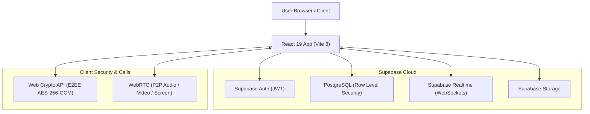

<div align="center">

# NodeTalk

**A real-time, end-to-end encrypted messaging & video calling web platform**

[](https://github.com/VishnuSreeVidya/NodeTalk/actions/workflows/ci.yml)
[](LICENSE)
[](https://react.dev)
[](https://vite.dev)
[](https://supabase.com)
[](https://webrtc.org)
[](https://tailwindcss.com)

[Live Demo](https://nodetalk-sli6.onrender.com/) · [Report Bug](https://github.com/VishnuSreeVidya/NodeTalk/issues) · [Request Feature](https://github.com/VishnuSreeVidya/NodeTalk/issues)

</div>

---

## ⚡ Overview

**NodeTalk** is a modern, full-stack real-time communication platform built with React 19, Supabase, and WebRTC. It combines military-grade end-to-end encryption with peer-to-peer audio/video streaming, rich group messaging, and custom theme support.

---

## ✨ Key Features

- **🔐 End-to-End Encryption**: Secure 1-on-1 chats powered by Web Crypto API (AES-256-GCM + ECDH P-256 key exchange). Zero plaintext saved on servers.
- **⚡ Real-time Messaging**: Instant delivery, typing indicators, read receipts, and online presence via Supabase Realtime.
- **📞 Audio & Video Calls**: Peer-to-peer HD video, voice calling, and screen sharing built on WebRTC with quality indicators.
- **👥 Group Messaging**: Multi-member rooms with role management (Admin, Moderator, Member).
- **📁 Media & File Sharing**: Image previews, voice notes, document sharing, and organized media gallery.
- **🎨 6 Color Themes**: Midnight, Graphite, Ocean, Forest, Light Pro, and AMOLED modes.
- **📱 PWA & Accessibility**: Installable Progressive Web App with offline caching, screen-reader optimizations, and keyboard navigation.

---

## 🛠️ Tech Stack

| Layer | Technology |
| :--- | :--- |
| **Frontend** | React 19, Vite 8, Tailwind CSS, Framer Motion |
| **Backend & DB** | Supabase (PostgreSQL, Row Level Security, Auth, Storage) |
| **Real-time** | Supabase Realtime (WebSocket channels, `postgres_changes`) |
| **Encryption** | Web Crypto API (ECDH P-256 key exchange, AES-256-GCM) |
| **Calls & Media** | WebRTC (RTCPeerConnection), MediaRecorder API |
| **Testing & CI** | Vitest, Testing Library, GitHub Actions |

---

## 🏗️ Architecture Diagram



---

## 🚀 Getting Started

### Prerequisites

- **Node.js**: `v24+` recommended
- **npm**
- A **Supabase** project account

### Quick Start

1. **Clone repository**
   ```bash
   git clone https://github.com/VishnuSreeVidya/NodeTalk.git
   cd NodeTalk
   ```

2. **Install dependencies**
   ```bash
   npm install
   ```

3. **Configure Environment**
   Create `.env` file in root:
   ```env
   VITE_SUPABASE_URL=https://your-project.supabase.co
   VITE_SUPABASE_ANON_KEY=your-supabase-anon-key
   ```

4. **Database Setup**
   Run SQL scripts from root in your Supabase SQL Editor sequentially (`supabase-schema.sql` → `supabase-migration-v2.sql` ... `v5.sql`).

5. **Start Dev Server**
   ```bash
   npm run dev
   ```

---

## 🧪 Commands & Testing

| Command | Action |
| :--- | :--- |
| `npm run dev` | Start development server |
| `npm run build` | Production build with code splitting |
| `npm run preview` | Preview production build |
| `npm run test` | Run test suite with Vitest |
| `npm run lint` | Run ESLint check |

---

## ⌨️ Shortcuts

| Shortcut | Action |
| :--- | :--- |
| <kbd>Ctrl</kbd> + <kbd>K</kbd> | Search messages / contacts |
| <kbd>Ctrl</kbd> + <kbd>N</kbd> | New conversation |
| <kbd>Esc</kbd> | Close active modal / panel |
| <kbd>Enter</kbd> | Send message |

---

## 📜 License

Distributed under the MIT License. See `LICENSE` for details.

---

<div align="center">
  Built by <b><a href="https://github.com/VishnuSreeVidya">Vishnu Sree Vidya Kotturu</a></b>
</div>
