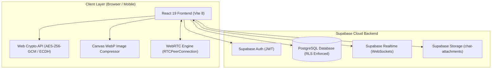
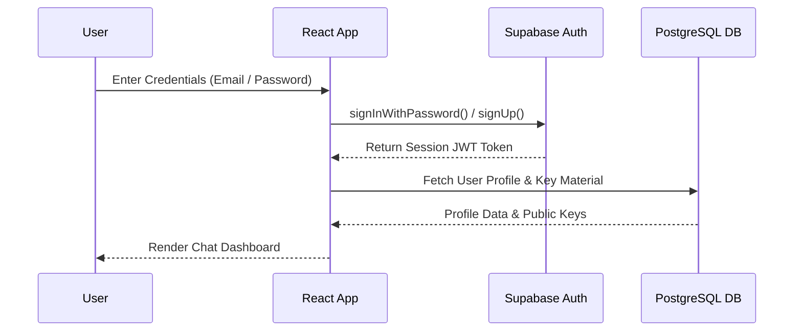
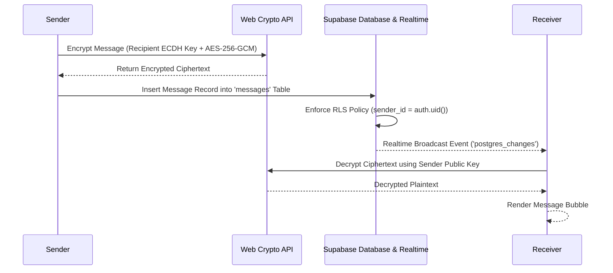
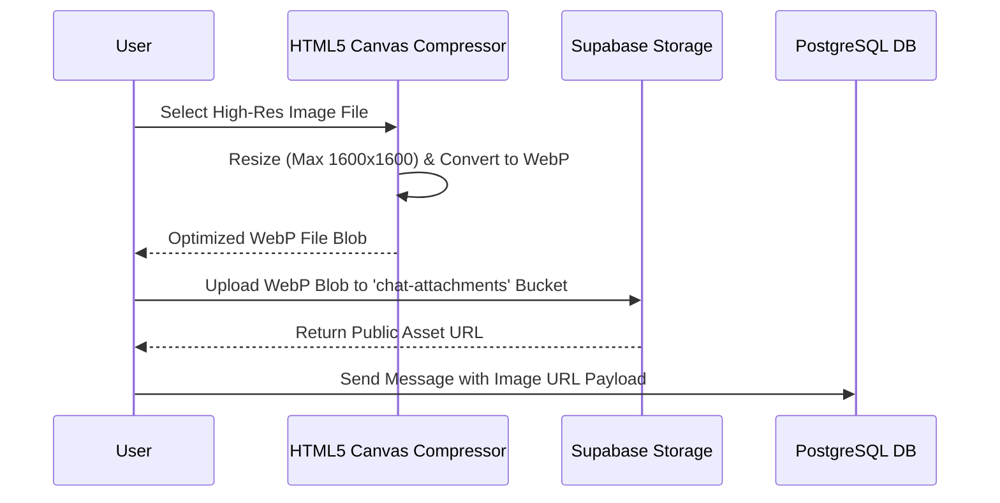
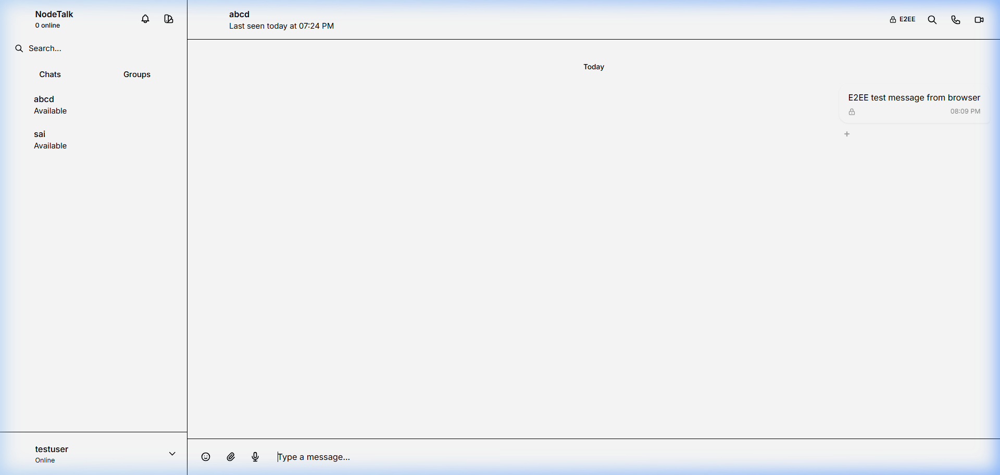
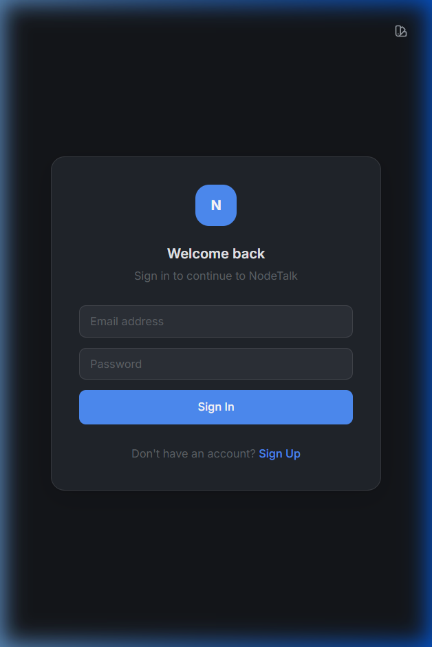

# NodeTalk

A real-time, end-to-end encrypted messaging and peer-to-peer video calling platform built with React 19, Supabase, and WebRTC.

---

## 🎯 Project Overview

**NodeTalk** is a full-stack real-time communication application designed for secure, responsive, and cross-platform messaging and media sharing. It addresses the privacy and user-experience gaps found in traditional web chat interfaces by combining client-side cryptographic primitives with dynamic realtime WebSocket delivery.

### What Problem It Solves
Standard web chat platforms often rely on server-side message inspection or plain database storage. NodeTalk ensures that 1-on-1 messages are encrypted on the sender's device before network transmission, preventing unauthorized access, backend eavesdropping, or database leak exposure.

### Target Audience
* Individuals seeking private, client-side encrypted communication.
* Remote teams needing real-time messaging with peer-to-peer audio/video calls.
* Technical recruiters and developers evaluating modern React 19, WebRTC, and Supabase architecture.

### Why NodeTalk Stands Out
Unlike basic chat applications built with centralized servers, NodeTalk combines **Web Crypto API (AES-256-GCM + ECDH P-256)**, **WebRTC peer-to-peer streaming**, **PostgreSQL Row Level Security (RLS)**, and **100dvh mobile viewport fitting** in a cohesive, responsive React architecture.

---

## ✨ Key Features

### 💬 Real-Time Messaging

* **One-to-One Direct Messaging**: Instant private conversations with encrypted text payloads.
* **Real-Time Message Updates**: Powered by Supabase Realtime WebSocket subscriptions (`postgres_changes` & broadcast channels).
* **Live Typing Indicators**: Real-time typing indicators displaying active user handles (e.g., `User is typing...`) with glowing dot animations.
* **Online/Offline Presence**: Automatic last-seen timestamps and live online status updates.
* **Delivery & Read Receipts**: Visual status checkmarks (`✓` delivered, `✓✓` read).
* **Message Deletions**: Dual-mode deletion support for both **Delete for Me** (`message_deletions` table) and **Delete for Everyone** (sender-initiated updates).
* **Reply Functionality**: Contextual message thread replies with preview banners (`reply_to` foreign key).
* **Media & Attachment Sharing**: Support for image attachments, audio notes, and documents.
* **Message Reactions & Starred Messages**: Real-time emoji reactions (`reactions` table) and message bookmarking (`starred_messages` table).

### 🔐 Security

* **Authentication**: Supabase Auth using secure JWT session tokens and bcrypt password hashing.
* **Row Level Security (RLS)**: Enforced at the PostgreSQL database layer for all tables, restricting row access to authenticated participants (`sender_id = auth.uid()` OR `receiver_id = auth.uid()`).
* **AES-256-GCM Encryption**: Client-side symmetric authenticated encryption for direct message payloads.
* **ECDH P-256 Key Exchange**: Elliptic-Curve Diffie-Hellman P-256 key pair generation for secure per-conversation shared secret derivation.
* **Passphrase-Protected Key Backup**: User private key backups are encrypted with **PBKDF2-HMAC-SHA256** using **100,000 iterations**, safeguarding key material against brute-force attacks while supporting legacy fallback decoding.
* **Input Sanitization**: XSS defense via `escapeHtml` string encoding prior to rendering formatted markdown.

### 📞 Video & Audio Calling

* **Audio Calls**: Low-latency peer-to-peer audio streaming via WebRTC `RTCPeerConnection`.
* **Video Calls**: High-definition video calling with local/remote video stream overlays.
* **Screen Sharing**: In-call screen sharing powered by `navigator.mediaDevices.getDisplayMedia`.
* **Peer-to-Peer Communication**: Media streams travel directly between peers without routing video data through centralized servers.
* **Signaling Mechanism**: Multi-stage WebSocket signaling using `calls-global` broadcast channel for instant callee ringing notifications and dedicated `call-pair-XXX` rooms for SDP/ICE exchange.
* **Call Controls**: Interactive floating call control bar with mute, video toggle, screen share toggle, call duration timer, and hang-up controls.

### 🖼️ Media Handling

* **Image/File Uploads**: Drag-and-drop file upload handling via `FileUpload.jsx`.
* **Client-Side Canvas Compression**: High-resolution photos (up to 1600x1600) are resized on an offscreen HTML5 `<canvas>` before network transfer.
* **WebP Conversion**: Automatic client-side image conversion to WebP format, significantly reducing payload size and bandwidth usage.
* **Supabase Storage Integration**: Media files are stored securely in Supabase Storage buckets (`chat-attachments`) with public URL resolution.
* **File Restrictions**: Configurable client-side file validation enforcing file type filtering (`ALLOWED_FILE_TYPES`) and maximum file size thresholds (`MAX_FILE_SIZE`).

### 📱 Responsive UI

* **Cross-Platform Compatibility**: Consistent user experience across desktop, tablet, and mobile displays.
* **Dynamic Viewport Height (`100dvh`)**: Root container uses `100dvh` to prevent mobile address bars on iOS Safari and Chrome Android from obscuring message input areas.
* **Mobile Drawer Navigation**: Responsive slide-over sidebar with a back navigation arrow (`←`) for small viewports (`< 768px`).
* **Flexbox Safeguards (`min-w-0 flex-grow`)**: Flexbox container rules prevent text inputs and action buttons from collapsing on narrow screens (360px–414px).
* **6 Color Theme Palettes**: User-configurable themes (Midnight, Graphite, Ocean, Forest, Light Pro, AMOLED) with instant CSS custom property switching.

---

## 🏗️ System Architecture



### Component Breakdown
* **React 19 / Vite 8 Frontend**: Manages application state, theme switching, message lists, and modal interfaces using modular component decomposition.
* **Web Crypto API**: Executes client-side key generation, shared secret derivation, and AES-GCM payload encryption directly inside the browser sandbox.
* **Supabase Realtime**: Listens to database table changes (`postgres_changes`) and relays WebSocket broadcast events for typing, presence, and WebRTC call signaling.
* **PostgreSQL + Row Level Security**: Stores user profiles, encrypted message payloads, reactions, group metadata, and RLS access rules.
* **Supabase Storage**: Hosts uploaded media files, avatar images, and attachment assets.
* **WebRTC Subsystem**: Handles peer-to-peer audio, video, and screen sharing streams directly between client endpoints.

---

## 🔄 Application Flow

### Authentication Flow


### Messaging Flow


### File Upload Flow


## 🗄️ Database

NodeTalk utilizes PostgreSQL managed by Supabase, enforcing strict Row Level Security (RLS) policies across all tables.

### Database Tables & Schema

#### 1. `profiles`
Extends `auth.users` with user profile information and online status.
* `id` (UUID, Primary Key, Foreign Key -> `auth.users.id` ON DELETE CASCADE)
* `username` (TEXT, Unique, Not Null)
* `avatar_url` (TEXT)
* `bio` (TEXT)
* `status_message` (TEXT, Default: `'Hey there! I am using NodeTalk.'`)
* `is_online` (BOOLEAN, Default: `false`)
* `last_seen` (TIMESTAMPTZ, Default: `now()`)
* `current_theme` (TEXT, Default: `'glass-dark'`)
* `created_at` (TIMESTAMPTZ, Default: `now()`)

#### 2. `messages`
Stores 1-on-1 direct message records and encrypted payloads.
* `id` (BIGSERIAL, Primary Key)
* `sender_id` (UUID, Foreign Key -> `profiles.id` ON DELETE CASCADE)
* `receiver_id` (UUID, Foreign Key -> `profiles.id` ON DELETE CASCADE)
* `message_text` (TEXT)
* `image_url` (TEXT)
* `encrypted` (BOOLEAN, Default: `false`)
* `encrypted_text` (TEXT)
* `reply_to` (BIGINT, Foreign Key -> `messages.id` ON DELETE SET NULL)
* `created_at` (TIMESTAMPTZ, Default: `now()`)

#### 3. `user_keys`
Stores E2EE public key JWKs and passphrase-derived encrypted key backups.
* `id` (UUID, Primary Key, Foreign Key -> `auth.users.id` ON DELETE CASCADE)
* `public_key` (TEXT, Not Null)
* `encrypted_key_backup` (TEXT)
* `created_at` (TIMESTAMPTZ, Default: `now()`)

#### 4. `reactions`
Stores message emoji reactions.
* `id` (BIGSERIAL, Primary Key)
* `message_id` (BIGINT, Foreign Key -> `messages.id` ON DELETE CASCADE)
* `user_id` (UUID, Foreign Key -> `profiles.id` ON DELETE CASCADE)
* `emoji` (TEXT, Not Null)
* `created_at` (TIMESTAMPTZ, Default: `now()`)
* **Unique Constraint**: `UNIQUE(message_id, user_id, emoji)`

#### 5. `message_deletions`
Tracks "Delete for Me" records for 1-on-1 messages.
* `id` (UUID, Primary Key, Default: `gen_random_uuid()`)
* `message_id` (BIGINT, Foreign Key -> `messages.id` ON DELETE CASCADE)
* `user_id` (UUID, Foreign Key -> `profiles.id` ON DELETE CASCADE)
* `deleted_at` (TIMESTAMPTZ, Default: `now()`)
* **Unique Constraint**: `UNIQUE(message_id, user_id)`

#### 6. `groups`, `group_members`, `group_messages`, `group_message_deletions`
Tables supporting multi-member group conversations, role assignments (`admin`, `moderator`, `member`), group messaging, and per-user group message deletions.

### Row Level Security (RLS) Policies

All public schema tables enforce RLS:
* **`profiles`**: Select permitted for all authenticated users; Update restricted to `id = auth.uid()`.
* **`messages`**: Select permitted only for `sender_id = auth.uid() OR receiver_id = auth.uid()`; Insert permitted only for `sender_id = auth.uid()`.
* **`user_keys`**: Select permitted for all authenticated users; Insert/Update restricted to `id = auth.uid()`.
* **`message_deletions`**: Select/Insert/Update restricted to `user_id = auth.uid()`.

---

## 🛠️ Tech Stack

| Category | Technology | Purpose |
| :--- | :--- | :--- |
| **Frontend** | React 19 | Core UI component framework |
| **Build Tool** | Vite 8 | Development server and bundle optimizer |
| **Styling** | Tailwind CSS | Utility-first responsive styling system |
| **Animations** | Framer Motion | Smooth UI transitions and modal animations |
| **Backend & Services** | Supabase | Managed BaaS backend infrastructure |
| **Database** | PostgreSQL | Relational database with Row Level Security |
| **Real-Time** | Supabase Realtime | WebSocket channels & table change subscriptions |
| **Storage** | Supabase Storage | Object storage for avatars and file attachments |
| **Authentication** | Supabase Auth | JWT session management & auth rules |
| **Calling** | WebRTC | Peer-to-peer audio, video, and screen sharing |
| **Cryptography** | Web Crypto API | AES-256-GCM encryption & ECDH P-256 key exchange |
| **Testing** | Vitest & Testing Library | Unit, integration, and UI component testing |
| **Code Quality** | ESLint | Code linting and hook rule verification |

---

## 📂 Project Structure

```text
custom-chat-app/
├── public/                     # Static public assets
├── docs/                       # Project documentation & screenshots
│   └── images/
│       ├── desktop-chat.png    # Desktop chat interface screenshot
│       └── mobile-layout.png   # Mobile layout interface screenshot
├── src/
│   ├── assets/                 # SVGs and static brand assets
│   ├── components/             # Core UI components
│   │   ├── shared/             # Reusable shared components (Headers, Modals, Indicators)
│   │   ├── Auth.jsx            # Authentication form component
│   │   ├── CallHandler.jsx     # WebRTC call UI overlay handler
│   │   ├── ChatWindow.jsx      # Main 1-on-1 chat window interface
│   │   ├── FileUpload.jsx      # File upload handler with compression
│   │   ├── MessageBubble.jsx   # Message rendering bubble component
│   │   ├── MessageInput.jsx    # Chat input bar with attachment controls
│   │   ├── ProfileModal.jsx    # Profile view & editing modal
│   │   ├── SettingsModal.jsx   # Settings & key backup management modal
│   │   └── Sidebar.jsx         # Conversation sidebar & user navigation
│   ├── context/                # React Context providers
│   │   ├── AuthContext.jsx     # Global authentication context
│   │   └── ThemeContext.jsx    # Theme state management provider
│   ├── features/               # Domain-specific feature modules
│   │   ├── chat/               # Chat search and media gallery hooks
│   │   ├── groups/             # Group creation and group chat windows
│   │   └── search/             # Global search panel feature
│   ├── hooks/                  # Custom React hooks
│   │   ├── useChatScroll.js    # Auto-scroll & pagination hook
│   │   ├── useDebounce.js      # Value debouncing hook
│   │   ├── useRealtimeSubscription.js # Supabase subscription hook
│   │   └── useWebRTC.js        # WebRTC signaling & media hook
│   ├── lib/                    # Library configurations & utilities
│   │   ├── constants.js        # Global app constants
│   │   ├── supabase.js         # Supabase client initialization
│   │   └── utils.js            # Date formatting, HTML escaping & image compression
│   ├── services/               # API service abstraction layers
│   │   ├── groupService.js     # Group API calls
│   │   ├── messageService.js   # Message fetching & mutation services
│   │   └── userService.js      # User profile services
│   ├── test/                   # Vitest test setup and suite files
│   │   ├── deletion.test.js    # Message deletion integration tests
│   │   ├── reliability.test.js # E2EE & refresh persistence tests
│   │   └── setup.js            # Vitest DOM environment setup
│   ├── ui/                     # Basic UI primitives (Button, Modal, Avatar)
│   └── utils/                  # Utility helpers
│       ├── crypto.js           # Web Crypto E2EE & PBKDF2 key derivation functions
│       └── offlineDb.js        # IndexedDB offline storage helper
├── supabase-schema.sql         # Base database schema & SQL definitions
├── supabase-migration-v2.sql ... v9.sql # Incremental database migrations
├── tailwind.config.js          # Tailwind CSS theme configuration
├── vite.config.js              # Vite bundler configuration
├── vitest.config.js            # Vitest runner configuration
├── package.json                # Project dependencies and script definitions
└── README.md                   # Project documentation
```

---

## 🚀 Installation & Setup

### 1. Clone Repository
```bash
git clone https://github.com/VishnuSreeVidya/NodeTalk.git
cd custom-chat-app
```

### 2. Install Dependencies
```bash
npm install
```

### 3. Configure Environment Variables
Create a `.env` file in the root folder:
```env
VITE_SUPABASE_URL=your_supabase_project_url
VITE_SUPABASE_ANON_KEY=your_supabase_anon_key
```

### 4. Database Setup & Migrations
Execute the SQL files sequentially in your Supabase SQL Editor:
1. `supabase-schema.sql` (Creates base tables, RLS policies, and triggers)
2. `supabase-migration-v2.sql` through `supabase-migration-v9.sql` (Applies group features, message deletion tables, and security policies)

### 5. Run Development Server
```bash
npm run dev
```

The application will launch at `http://localhost:5173`.

---

## 🔑 Environment Variables

NodeTalk requires the following client-side environment variables:

```env
# Supabase Project Endpoint URL
VITE_SUPABASE_URL=your_supabase_project_url

# Supabase Anonymous Client API Key
VITE_SUPABASE_ANON_KEY=your_supabase_anon_key
```

> **Note**: Never expose service-role secret keys in client-side code. All user operations are authorized securely via standard JWT tokens and Row Level Security (RLS).

---

## 🧪 Testing

NodeTalk uses **Vitest**, **Testing Library**, and **jsdom** for automated testing and code quality verification.

### Running Tests
```bash
# Run all Vitest unit and integration tests
npm run test

# Launch Vitest interactive UI test runner
npm run test:ui

# Run ESLint code quality & hook audit
npm run lint
```

### Tested Modules
* **Crypto Engine** (`crypto.test.js`): Verifies ECDH key derivation, AES-256-GCM encryption/decryption round-trips, and safe fallback handling on key mismatch.
* **Message Deletions** (`deletion.test.js`): Verifies "Delete for Me" and "Delete for Everyone" behavior.
* **Scroll & Reliability** (`reliability.test.js` & `scrollBehavior.test.js`): Verifies unread badge counting, message pagination, and scroll positioning.

---

## 📸 Screenshots

| Direct Message Chat Interface | Mobile Adaptive Layout |
| :---: | :---: |
|  |  |
| *Encrypted 1-on-1 conversation view* | *Responsive mobile interface with drawer navigation* |

---

## 🌐 Live Demo

Experience NodeTalk live in your browser:

> 🚀 **Live Demo Application**: [https://nodetalk-sli6.onrender.com/](https://nodetalk-sli6.onrender.com/)

---

## 🔐 Security Considerations

### Transport vs Application vs End-to-End Encryption

* **Transport Security**: All API requests, database queries, and WebSocket connections travel over HTTPS/WSS (TLS 1.3).
* **Application Access Control**: Database access is governed by PostgreSQL Row Level Security (RLS), restricting row-level data access strictly to authorized users based on JWT token claims (`auth.uid()`).
* **End-to-End Encryption (1-on-1 Chats)**: Direct messages are encrypted using **AES-256-GCM** with **ECDH P-256** key exchange. Message text is encrypted on the sender's client before network transmission, ensuring that plaintexts are inaccessible to database observers.

### Passphrase Security & Key Derivation
User private key backups are encrypted using **PBKDF2-HMAC-SHA256** with **100,000 iterations**, protecting passphrase backups against brute-force dictionary attacks.

---

## ⚡ Performance & Optimization

* **Client-Side Image Resizing**: Uploaded images are resized to a maximum dimension of 1600x1600 and converted to WebP format via HTML5 Canvas, significantly reducing storage consumption and upload latency.
* **Component Lazy Loading**: Major views (`ChatWindow`, `CallHandler`, `Sidebar`, `Auth`) are lazy-loaded via React `Suspense` and `React.lazy`, optimizing initial bundle size.
* **Optimized Database Queries**: Indexed queries (`idx_messages_sender_receiver`, `idx_messages_created_at`) maintain query performance during message pagination.
* **WebRTC Resource Cleanup**: Active audio/video media tracks (`MediaStreamTrack.stop()`) and peer connections (`RTCPeerConnection.close()`) are closed when calls end to prevent memory leaks.

---

## 🧩 Challenges & Technical Solutions

### 1. WebRTC Call Signaling Channel Mismatch
* **Problem**: In initial WebRTC implementations, call offer broadcasts sent on dynamic callee channels were missed if the recipient was not already viewing the active chat window.
* **Solution**: Implemented a global broadcast channel (`calls-global`) that every logged-in user subscribes to upon application launch, ensuring incoming call offers trigger the ringing overlay immediately regardless of active view state.

### 2. Mobile Viewport Input Clipping
* **Problem**: Standard CSS `100vh` on mobile browsers (iOS Safari, Android Chrome) caused mobile browser address bars to obscure the message input bar.
* **Solution**: Applied dynamic viewport units (`100dvh`) combined with flexbox overflow safeguards (`min-w-0 flex-grow`), preserving message input bar visibility across all mobile viewports.

---

## 🔮 Future Enhancements

The following features are planned for future engineering releases:

* **Group Payload E2EE**: Extending 1-on-1 ECDH encryption to multi-party group channels via pairwise key distribution.
* **TURN Relay Server Integration**: Adding configured TURN servers (e.g., Coturn / Twilio TURN) for WebRTC calls across restrictive symmetric NATs and firewalls.
* **Push Notifications**: Integrating Web Push API and service workers for background incoming call and message alerts when the app is closed.

---

## 📊 Project Highlights

* **End-to-End Encryption**: Client-side AES-256-GCM + ECDH P-256 messaging.
* **Peer-to-Peer Calls**: Real-time video, audio, and screen sharing via WebRTC.
* **PostgreSQL + RLS**: Granular database-level access authorization.
* **Client-Side WebP Compression**: Automated media payload optimization.
* **Cross-Platform Responsive UI**: Built with React 19, Tailwind CSS, and `100dvh` viewport fitting.
* **Automated Testing**: 58 Vitest unit/integration tests and zero ESLint warnings.

---

## 👩‍💻 Author

**Vidya Kotturu**  
Computer Science Student | Frontend Developer | Cybersecurity Enthusiast

* GitHub: [https://github.com/VishnuSreeVidya](https://github.com/VishnuSreeVidya)

---

## 📄 License

This project is open source and available under the **[MIT License](LICENSE)**.
